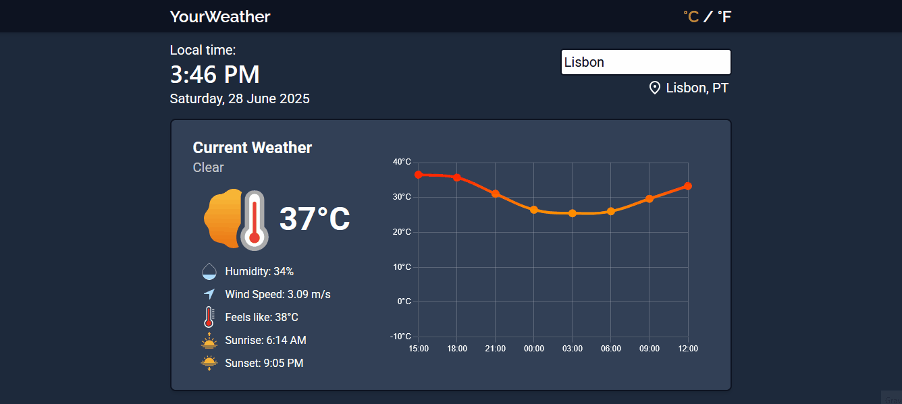
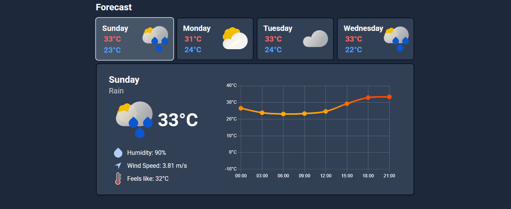

#  YourWeather - Weather App

**YourWeather** is a weather application built with React and Vite. It displays real-time weather data and a 4-day forecast, complete with animated icons, unit switching between °C and °F, and dynamic visual elements to enhance the user experience.

## Live Demo

Try it out here  [your-weather-yonagonca.vercel.app](https://your-weather-yonagonca.vercel.app/)


## Features

- **Current Weather**  
  Displays temperature, wind speed, humidity, sunrise, and sunset times.

- **4-Day Forecast**  
  Includes dynamic weather icons, wind speed, and humidity indicators for each day.

- **Dynamic Weather Icons**  
  Adjusted based on time of day (day/night) and weather code.

- **Unit Switching**  
  Toggle between Celsius (°C) and Fahrenheit (°F) instantly.

- **Animated Weather Visuals**  
  Transitions powered by Framer Motion and styled using Tailwind CSS.


## Screenshots

###  Current Weather View


###  4-Day Forecast



## Getting Started

### 1. Clone the repository

```bash
git clone https://github.com/YonaGonca/your-weather.git
cd your-weather
```

### 2. Install dependencies

```bash
npm install
```

### 3. Run the development server

```bash
npm run dev
```

## Tech Stack

- **Frontend Framework**: [React](https://reactjs.org/)
- **Build Tool**: [Vite](https://vitejs.dev/)
- **Styling**: [Tailwind CSS](https://tailwindcss.com/)
- **Animations**: [Framer Motion](https://www.framer.com/motion/)
- **Charts**: [Chart.js](https://www.chartjs.org/)
- **Weather Data**: [OpenWeatherMap API](https://openweathermap.org/api)
- **Deployment**: [Vercel](https://vercel.com/) 


## Environment Variables

To run this project, create a `.env` file in the root directory and add the following:

```env
VITE_WEATHER_API_KEY=your_api_key_here
```
You can get a free API key by signing up at [OpenWeatherMap API](https://openweathermap.org/api).

## Contributing

Pull requests are welcome! For major changes, please open an issue first to discuss what you would like to change.

## Acknowledgements

- Thanks to **[OpenWeatherMap](https://openweathermap.org/)** for providing reliable and accessible weather data.
- **[Vercel](https://vercel.com/)** for seamless deployment and hosting.
- Inspired by various modern weather UIs and minimalist design principles.
- Special thanks to the open-source community for their amazing tools and libraries.

## License

This project is licensed under the [MIT License](LICENSE).  

